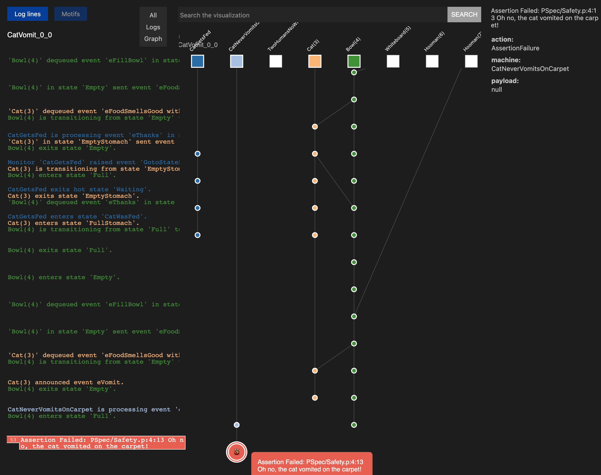

# Using Formal Methods To Prevent Cat Vomit

Playing around with the [P formal modelling framework](https://github.com/p-org/P).

## Scenario

My cat, Kiki, likes to eat too much and then vomit all over the living room carpet.

Often one human (either me or my wife) will feed her, then the other human will feed her again, unaware that she has already been fed.

What if we put a whiteboard next to her bowl, and we draw a tick on the whiteboard before feeding her? And of course, if there's already a tick on the whiteboard, there's no need to feed her, no matter how much she protests.

## Invariants

* Safety: the cat should never eat twice and vomit on the carpet
* Liveness: the cat should eat at least once

## Tests

1. A single human, no whiteboard needed :white_check_mark:
2. Two humans, not using a whiteboard :x:
    * Risk of the cat getting fed twice :ocean:
3. Two humans, using a whiteboard :white_check_mark:
    * The humans coordinate via the whiteboard to ensure the cat gets fed exactly once
4. Two humans, using a whiteboard, with failure :x:
    * Use a failure injector to randomly make one of the humans get distracted and wander off halfway through the task
    * If this happens between ticking the whiteboard and filling the bowl, the cat will not get fed

## How to run the tests

Follow the Getting Started instructions on the [P website](https://p-org.github.io/P/getstarted/install/).

I recommend using the VS Code extension (Peasy).

## Learn more about P

Check out [this talk](https://youtu.be/FdXZXnkMDxs?si=iFqpl16ONKZuS4C0) from AWS re:Invent 2023.

## Example failure trace

